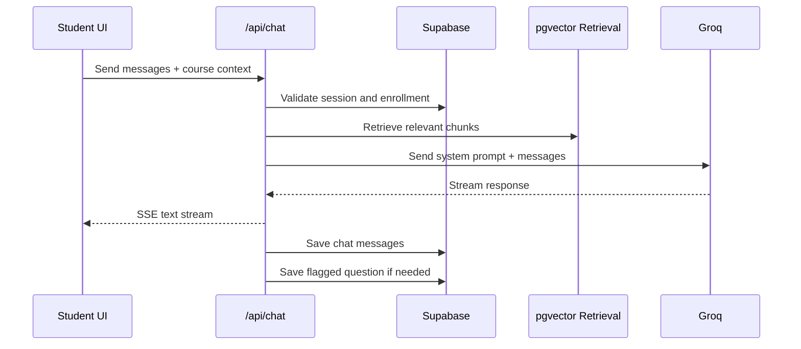
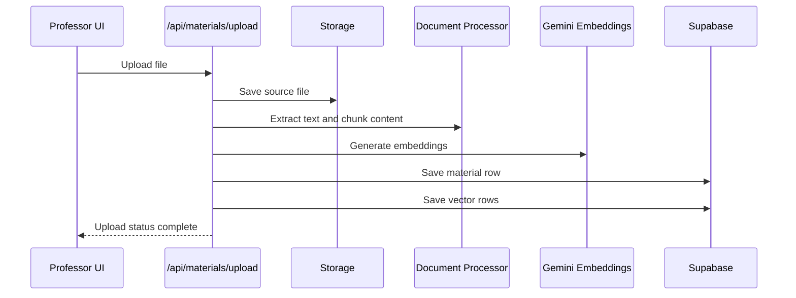
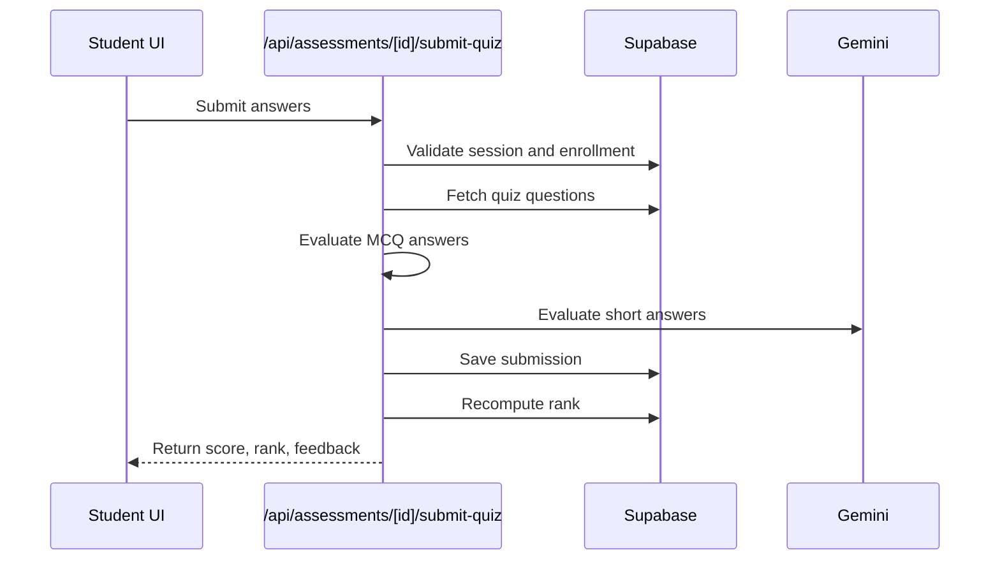
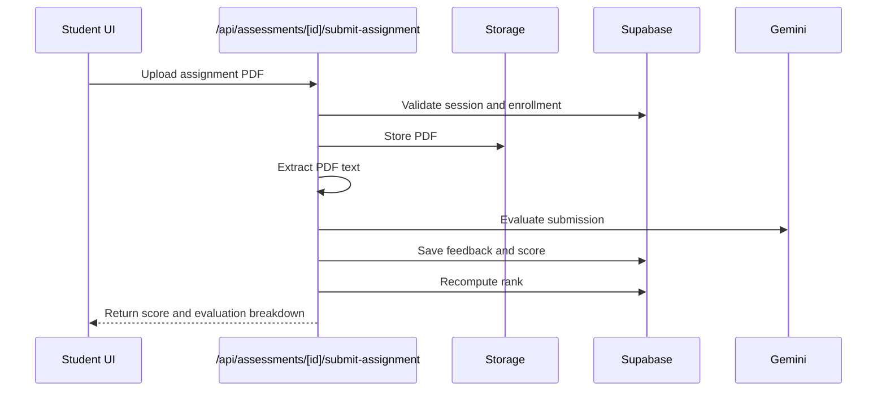
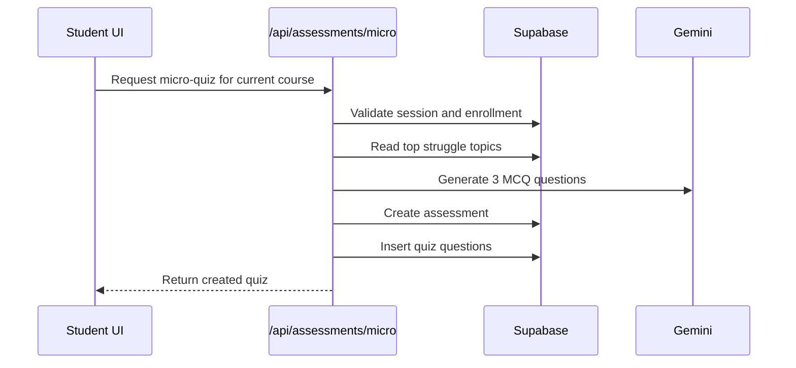
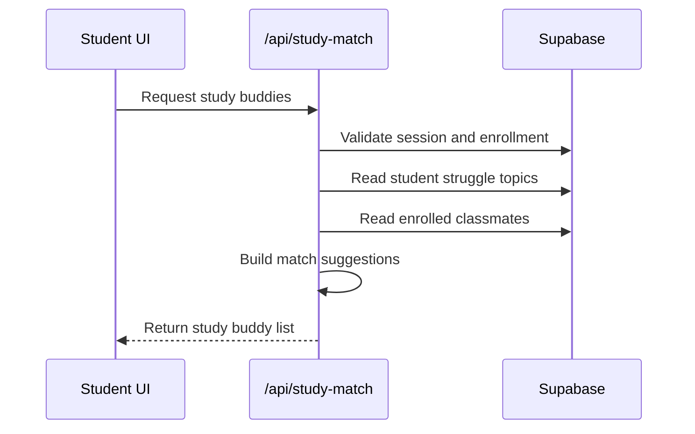
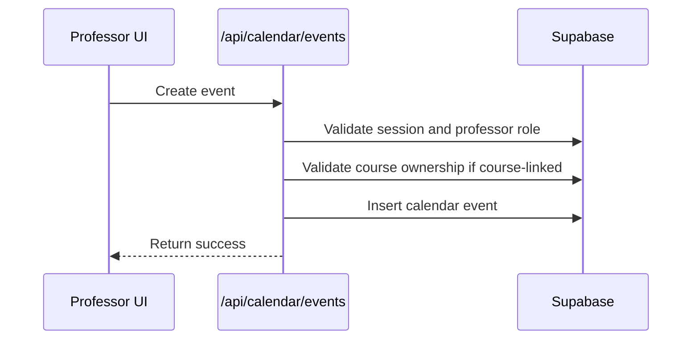
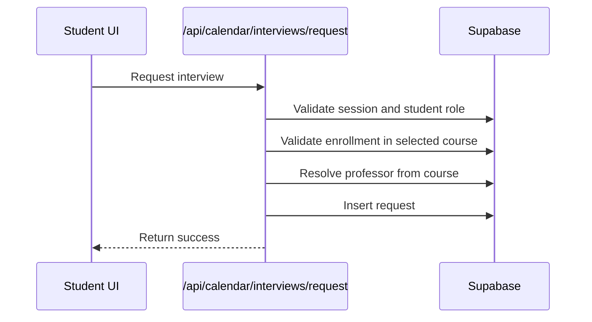
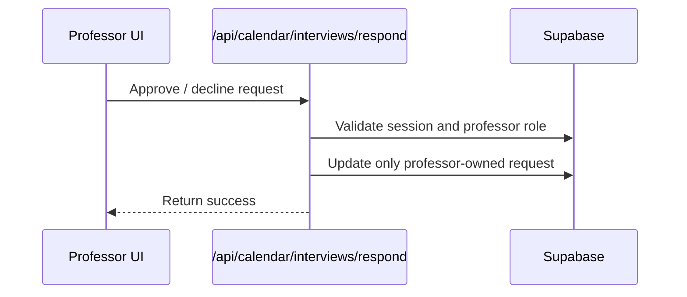
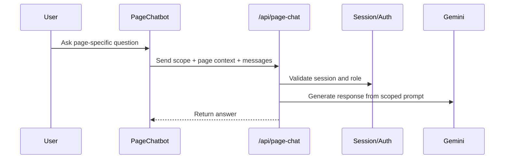

# API Flows and Backend Sequences

## 1. API Groups

### Authentication and Navigation Support
- Supabase Auth via server/client helpers
- middleware-based route redirection by role

### Course and Content APIs
- `/api/courses/parse-syllabus`
- `/api/materials/upload`

### Learning and Chat APIs
- `/api/chat`
- `/api/page-chat`

### Assessment APIs
- `/api/assessments/create`
- `/api/assessments/[assessmentId]/questions`
- `/api/assessments/[assessmentId]/submit-quiz`
- `/api/assessments/[assessmentId]/submit-assignment`
- `/api/assessments/micro`

### Analytics and Support APIs
- `/api/analytics/student`
- `/api/study-match`
- `/api/flagged/answer`

### Calendar APIs
- `/api/calendar/events`
- `/api/calendar/interviews/request`
- `/api/calendar/interviews/respond`

## 2. Chat Flow

### Purpose
Provide a course-aware AI tutor using RAG and stream the answer back to the student.

### Notes
- uses server-side session validation
- stores both user and assistant messages
- can tag struggle topics from student questions

## 3. Material Upload Flow

### Purpose
Convert uploaded documents into indexed course knowledge for retrieval.

## 4. Quiz Submission Flow

### Purpose
Evaluate a student quiz securely and store results.

### Notes
- does not trust browser-sent student identity
- supports both deterministic and AI-assisted grading

## 5. Assignment Submission Flow

### Purpose
Accept a PDF assignment, extract text, evaluate it, and store structured feedback.

## 6. Adaptive Micro-Quiz Flow

### Purpose
Generate a short quiz based on the student’s struggle topics.

## 7. Study Match Flow

### Purpose
Suggest peers who can support a student in struggle areas.

## 8. Calendar Event Flow

### Purpose
Allow professors to create academic events tied to courses or general schedule items.

## 9. Interview Request Flow

### Student Request

### Professor Response

## 10. Page Assistant Flow

### Purpose
Provide contextual assistants with page-bounded data.

## 11. Final Backend Design Principles

- server-side session validation for important student/professor operations
- route handlers specialized by domain rather than one monolithic backend
- AI calls reserved for high-value tasks such as tutoring, parsing, grading, and intelligence
- pgvector retrieval for course-grounded responses
- persistent storage of learning events for analytics and progress computation
