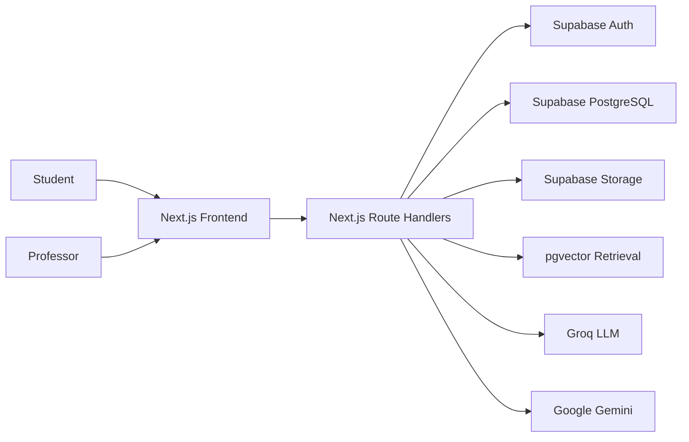
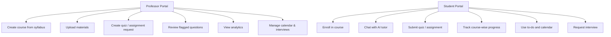
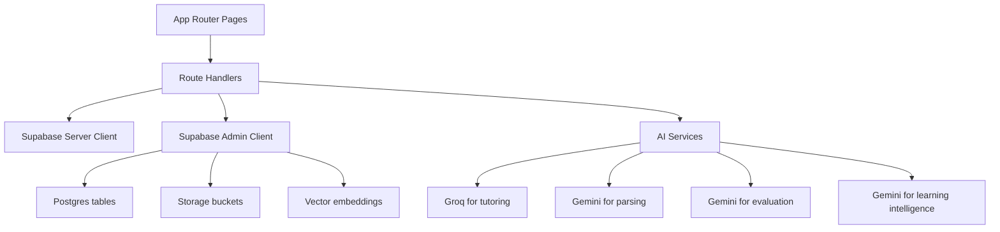
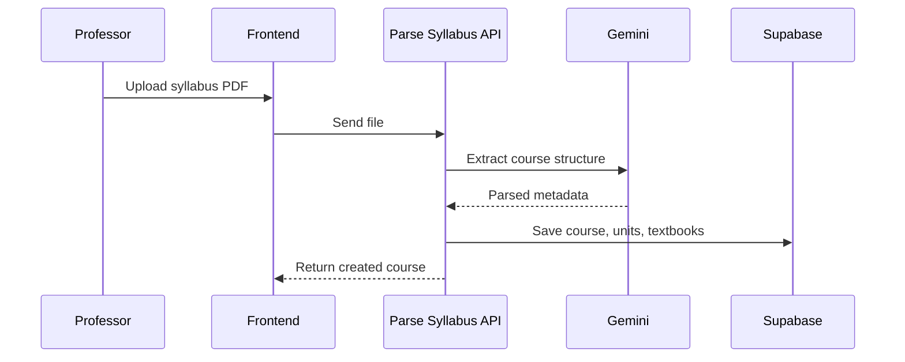
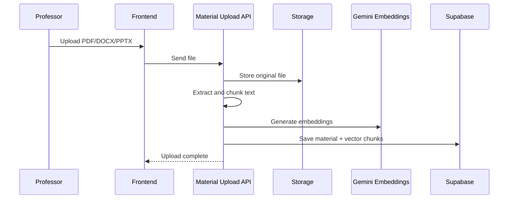
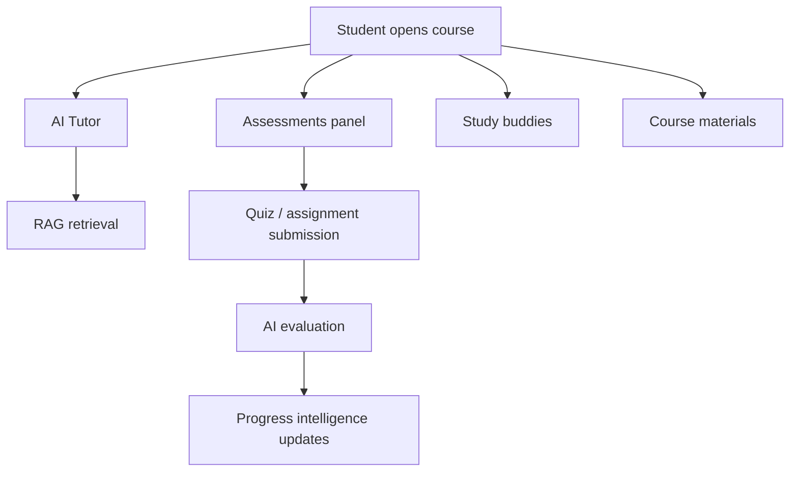
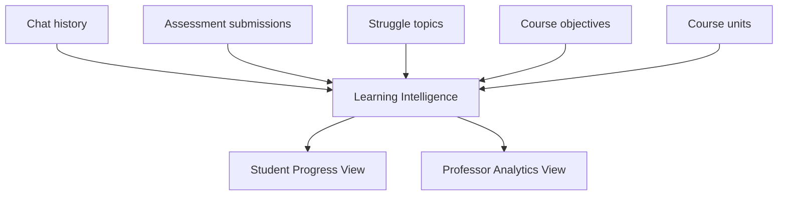
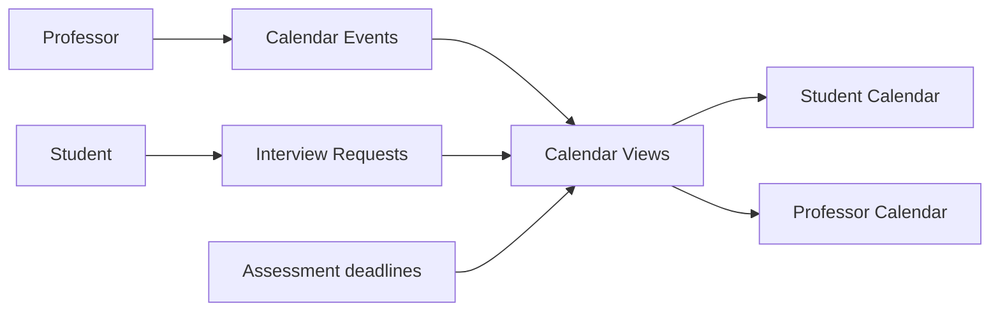
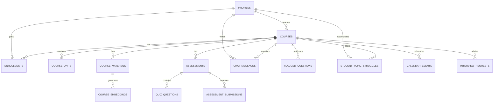

# Architecture and System Design

## 1. High-Level Architecture

## 2. Role-Based Product View

## 3. Backend Component Architecture

## 4. Core Functional Architecture

### 4.1 Course Ingestion

### 4.2 Material Upload and RAG

### 4.3 Student Learning Flow

## 5. Analytics Architecture

## 6. Calendar Architecture

## 7. Important Data Entities

Main tables used in the final system:

- `profiles`
- `courses`
- `enrollments`
- `course_units`
- `textbooks`
- `course_materials`
- `course_embeddings`
- `chat_messages`
- `flagged_questions`
- `assessments`
- `quiz_questions`
- `assessment_submissions`
- `student_topic_struggles`
- `calendar_events`
- `interview_requests`

## 8. High-Level Data Relationship Diagram

## 9. Architectural Highlights

- single full-stack codebase using Next.js App Router
- shared Supabase backend for auth, data, and storage
- hybrid AI design using Groq for tutoring and Gemini for structured tasks
- course-aware RAG pipeline through pgvector
- role-specific pages and assistants
- session-based validation for important student-facing operations
